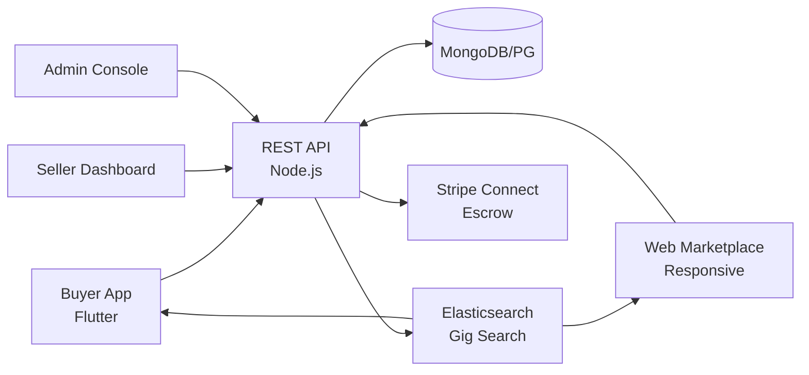

# Upwork Clone — White-Label Freelance & Marketplace Platform by Miracuves

**MXWork** is a production-ready, white-label Upwork clone: a complete white-label platform — delivered with **100% source code ownership** in **6 working days**.

> 🧑💻 **See it running before you talk to anyone.** Live buyer app, seller dashboard, and admin console — demo credentials are printed on the [solution page](https://miracuves.com/upwork-clone#demo). No sales call required.

---

## 🚀 Live Demos

| Environment | URL | What you can test |
|---|---|---|
| 📱 Buyer App | [mas.mimeld.com](https://mas.mimeld.com) | Search gigs, hire, message, fund milestones, release |
| 🌐 Web Marketplace | [mxwork.mimeld.com](https://mxwork.mimeld.com) | Full marketplace in the browser |
| 🎨 Seller Dashboard | [Solution page → Demo](https://miracuves.com/upwork-clone#demo) | Gigs, orders, earnings, analytics, payouts |
| 🛠️ Admin Console | [Solution page → Demo](https://miracuves.com/upwork-clone#demo) | Users, gigs, disputes, fraud, analytics |

Demo credentials for all environments: **[miracuves.com/upwork-clone → Demo section](https://miracuves.com/upwork-clone/#demo)**

---

## ✨ What Makes This Upwork Clone Different

Most upwork clone scripts stop at basic features. This platform ships with the features that actually run a *business*:

- **Milestone Escrow** — release payments per milestone — same escrow flow Upwork built its $5B/year GMV on
- **Tiered Seller Levels** — 
- **1-Tap Proposal Builder** — automatic level-up based on earnings + ratings (New → Level 1 → Top Rated → Pro) — mirrors Upwork's seller tier program
- **Multi-Category Gig System** — AI pre-triages disputes by reading chat, deliverables, and policy — human review for 5% of cases, resolution in 24h
- **AI Dispute Resolution** — predefined 100+ categories with structured deliverables — what makes Fiverr's catalog browseable

## 📦 Core Features

**Buyer:** search & filters · seller profiles · reviews · milestone funding · secure messaging · portfolio preview · orders & reorders · dispute resolution

**Seller (Freelancer):** profile & portfolio · gig management · proposal builder · earnings dashboard · withdraw methods · performance metrics · seller levels

**Admin:** user & KYC management · gig moderation · dispute resolution · escrow management · fraud detection · analytics reports

## 🏗️ Architecture

**Stack:** Flutter mobile apps (Android + iOS) · Node.js or Laravel backend · MongoDB/PostgreSQL · Elasticsearch for gig search · Stripe Connect for payouts · Stripe Connect, PayPal, regional gateways; escrow with auto-release

## 📋 What’s Included

- ✅ Full source code — backend, web, mobile apps, panels (no encryption, no license locks)
- ✅ Deployment to your servers & app store submission assistance
- ✅ Your branding — white-label rename, logo, colors, domain
- ✅ 60 days post-launch support + 12 months of free updates
- ✅ Documentation & handover

**Pricing:** from **$2,899**, transparent on the [solution page](https://miracuves.com/upwork-clone/#pricing) — no "contact us for quote" games.

## 🆚 Why Not Build From Scratch?

Custom freelance platforms run $80k–$400k and 5–10 months. A proven white-label base gets you to market in 6 working days for a fraction of that, with your budget preserved for seller acquisition and supply-side growth.

## 📚 Resources

- 📖 [Upwork Clone — Full Solution Page](https://miracuves.com/upwork-clone) (features, pricing, demos, FAQ)
- 💰 [How Much Does a Freelance App Cost in 2026?](https://miracuves.com/upwork-clone#pricing) pricing breakdown & what's included
- 📝 [Best Upwork Clone Script in 2026](https://miracuves.com/upwork-clone/blog/) features, pricing & launch guide
- 🧠 [Milestone Escrow: The Backbone of Trust](https://miracuves.com/upwork-clone/blog/) how escrow + milestones unlock GMV
- ✅ [Miracuves Facts & Claims Ledger](https://miracuves.com/upwork-clone/facts/) every claim we make, verified

## 🏢 About Miracuves

[Miracuves Solutions](https://miracuves.com) builds white-label clone apps and custom software from Mumbai, India — 90+ ready-made solutions, live demos for every product, transparent pricing, and delivery in 6 working days. Operating since 2010.

**Talk to us:** [WhatsApp](https://wa.me/919830009649) · [Schedule a consultation](https://miracuves.com/schedule-consultation/) · [miracuves.com](https://miracuves.com)

---

### ⚠️ Note on This Repository

This repository is a product overview. The full source code is delivered to clients on purchase — see [what’s included](https://miracuves.com/upwork-clone/#included). For a hands-on evaluation, use the live demos above; credentials are public on the solution page.

*Keywords: upwork clone, upwork clone script, freelance marketplace, gig economy, white label freelance, escrow payments, Flutter freelance app, Node.js marketplace*

---

<!--
══════════════════════════════════════════════════
TEMPLATE VARIABLE KEY — auto-generated from Netflix-Clone pattern
══════════════════════════════════════════════════
{APP_NAME}        Upwork Clone
{MX_NAME}         MXWork
{CATEGORY}        Freelance & Marketplace Platform
{DEMO_WEB}        mxwork.mimeld.com
{PRICE}           $2,899
{SLUG}            upwork-clone
{SOLUTION_URL}    https://miracuves.com/upwork-clone/
{VERTICAL}        freelance

See /tmp/verticals/freelance.txt for the vertical config used to generate this README.
══════════════════════════════════════════════════
-->